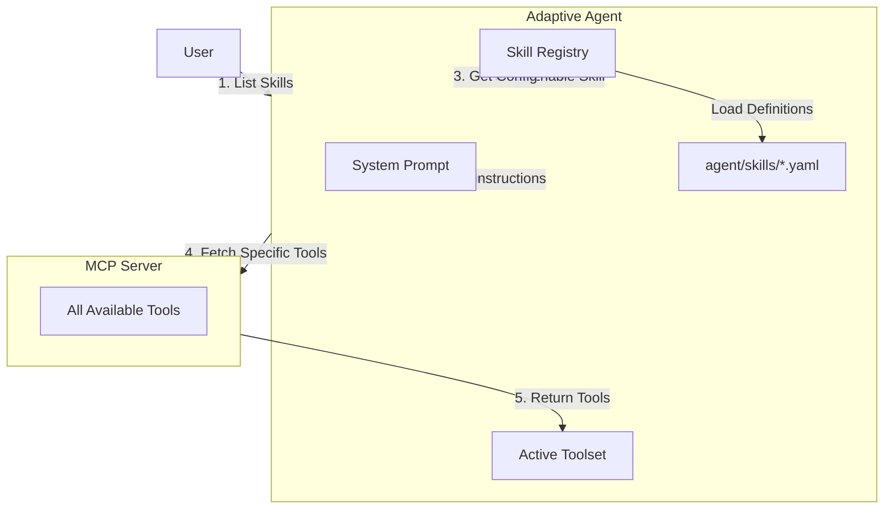

# Agent Skills (Client-Side Skill Manager)

The **Agent Skills** system in the Decentralized Agent Kit is designed to enable **dynamic capability loading**. Instead of overwhelming the Agent (and its context window) with every possible tool at startup, "Skills" allow the Agent to discover and load specialized capabilities on demand.

## Core Concept: Client-Side Skill Manager

Unlike traditional architectures where the MCP server dictates all available tools, the **Client-Side Skill Manager** shifts control to the Agent.

*   **Skills are Definitions**: A "Skill" is simply a configuration file (YAML) on the Agent's side that groups a set of tools and instructions under a high-level name (e.g., "text-processing").
*   **Lazy Loading**: The Agent starts with a minimal footprint. It knows *about* skills but hasn't loaded their heavy instructions or tools yet.
*   **Dynamic Injection**: When a skill is enabled, the Agent dynamically fetches the required tools from the MCP server and injects the skill's specific instructions into its system prompt.

## Architecture



### Key Components

1.  **Skill Registry (`agent/dak_agent/skill_registry.py`)**:
    *   Scans `agent/skills/` for YAML definitions.
    *   Validates skill format.
    *   Acts as the catalog of available capabilities.

2.  **Skill Definitions (`agent/skills/*.yaml`)**:
    *   **Metadata**: Name, Description.
    *   **Tools**: List of MCP tool names required for this skill.
    *   **Instructions**: Markdown text explaining how to use the skill and its tools.


## Workflow

1.  **Discovery**:
    The Agent uses the `list_skills()` tool to see what's available.
    *   *Output*:
        ```
        ## Curated Skills (Recommended)
        - filesystem: Manage files and directories (list, read, write, search).
        
        ## Individual Remote Tools
        - git_status: Check status of git repository.
        - git_commit: Commit changes to git repository.
        ```

2.  **Activation**:
    The Agent (or User) calls `enable_skill("filesystem")` OR `enable_skill("git_status")`.
    *   **Curated Skill**: Loads instructions and multiple tools as defined in YAML.
    *   **Zero-Config Tool**: Loads the specific tool schema and adds a generic instruction.

3.  **Execution**:
    The Agent now has access to the tool(s) and proceeds to solve the task.

## Zero-Config Tool Discovery

In addition to defined skills, the Agent automatically connects to the MCP server at startup and fetches the metadata (name and description) of *all* available tools.

*   **No YAML Required**: You don't need to create a YAML file to use a tool provided by an MCP server.
*   **Direct Access**: The Agent can see and enable any tool exposed by the MCP server.
*   **Use Case**: Ideal for quick exploration or when using 3rd party MCP servers with many tools.

## Developer Guide: Adding a New Skill

### 1. Define the Skill (Optional but Recommended)
Create a YAML file in `agent/skills/` (e.g., `git-automation.yaml`) to **group** tools and provide **rich instructions**.

```yaml
name: git-automation
description: Manage git repositories, branches, and commits.
tools:
  - git_status  # Must exist on MCP server
  - git_commit  # Must exist on MCP server
instructions: |
  # Git Automation
  Use this skill to manage the git repository.
  - Always check `git_status` before committing.
  - Write clear, conventional commit messages.
```

### 3. Verify
Restart the agent and ask: "What skills do you have?". Your new skill should appear.

## Benefits

*   **Context Optimization**: The LLM only sees tools and instructions relevant to the current task.
*   **3rd Party MCP Support**: You can define skills that map to tools provided by external MCP servers.
*   **Simplified Development**: Add simple scripts without writing complex MCP tool wrappers.
