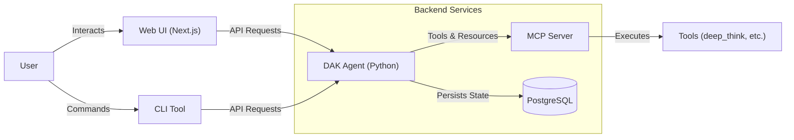

# Architecture Overview

The Decentralized Agent Kit (DAK) is designed to be a modular and extensible platform for building autonomous agents. It follows the Google Agent Development Kit (ADK) principles.

## Core Components

### 1. Agent Service (`agent/`)
The backend service responsible for:
- **LLM Integration**: Communicating with Large Language Models (Gemini, etc.) via `google-adk`.
- **State Management**: Storing conversation history and user context (PostgreSQL or In-Memory).
- **A2A Protocol**: Handling Agent-to-Agent communication via `/task/send` (or `/run`).
- **MCP Server**: Exposing tools and resources via the Model Context Protocol.

### 2. UI Service (`ui/`)
A Next.js-based web interface for interacting with the agent.
- **Authentication**: NextAuth.js integration for secure access (OAuth, Credentials).
- **Chat Interface**: Real-time chat with the agent.
- **Task Management**: Visualizing and managing agent tasks.

### 3. CLI Tool (`cli/`)
A command-line interface for developers and power users.
- **Direct Access**: Interact with the Agent API from the terminal.
- **Automation**: Scriptable commands for agent tasks.

## Infrastructure

- **Docker Compose**: Orchestrates all services (Agent, UI, Database).
- **PostgreSQL**: Provides persistence for conversation history.
