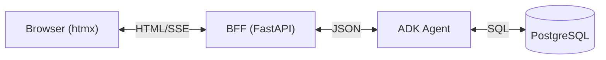

# BFF (Backend For Frontend) Architecture

This document describes the Backend For Frontend (BFF) architecture used in the Decentralized Agent Kit to provide a lightweight, htmx-based user interface.

## Overview

The BFF pattern is used to decouple the frontend requirements from the core agent logic. In this implementation:

1.  **ADK Agent (Backend)**: Pure JSON API. It knows nothing about HTML or UI concerns. It streams JSON events (text, tool calls, etc.).
2.  **BFF Service (Frontend Container)**: A FastAPI application that acts as the interface for the browser. It:
    *   Serves the initial HTML page.
    *   Proxies user requests to the Agent.
    *   Parses the Agent's JSON response.
    *   Converts the response into HTML fragments.
    *   Streams these fragments back to the browser using Server-Sent Events (SSE) or chunked HTTP responses.
3.  **Browser**: Uses **htmx** to swap these HTML fragments into the DOM, providing a dynamic SPA-like experience without writing custom JavaScript.

## Architecture Diagram



## Implementation Details

### BFF Service (`/bff`)

*   **Framework**: FastAPI (Python)
*   **Templating**: Jinja2
*   **Dependency Management**: `uv`

#### Key Components

1.  **`main.py`**:
    *   `GET /`: Renders `index.html`. Generates a unique session ID for the user.
    *   `POST /chat`: The main interaction endpoint.
        *   Accepts form data (`prompt`, `session_id`).
        *   Ensures a session exists on the Agent (creating one if necessary).
        *   Calls the Agent's `/run` endpoint.
        *   Parses the Agent's streaming JSON response.
        *   Separates "Thoughts" (tool calls/results) from "Final Answer".
        *   Yields HTML fragments for real-time UI updates.

2.  **`templates/index.html`**:
    *   Uses **htmx** for interactions (`hx-post`, `hx-target`, `hx-swap`).
    *   Includes CSS for styling the chat and the collapsible "Thinking Process" section.

### Agent Integration

The BFF communicates with the Agent using the standard ADK HTTP API:

*   `POST /apps/{app_name}/users/{user_id}/sessions`: Create a session.
*   `POST /run`: Send a message and get a response.

## Running the BFF

The BFF service is integrated into the Docker Compose setup.

```bash
docker compose up -d --build bff
```

Access the UI at: **http://localhost:8002**

## Benefits

*   **Separation of Concerns**: The Agent remains a pure API. The UI logic is contained entirely within the BFF.
*   **Simplicity**: No complex frontend build chain (React, Webpack, etc.) is required for this view. Python developers can maintain the full stack.
*   **Flexibility**: The Agent can be swapped or updated without breaking the UI, as long as the API contract remains compatible.
