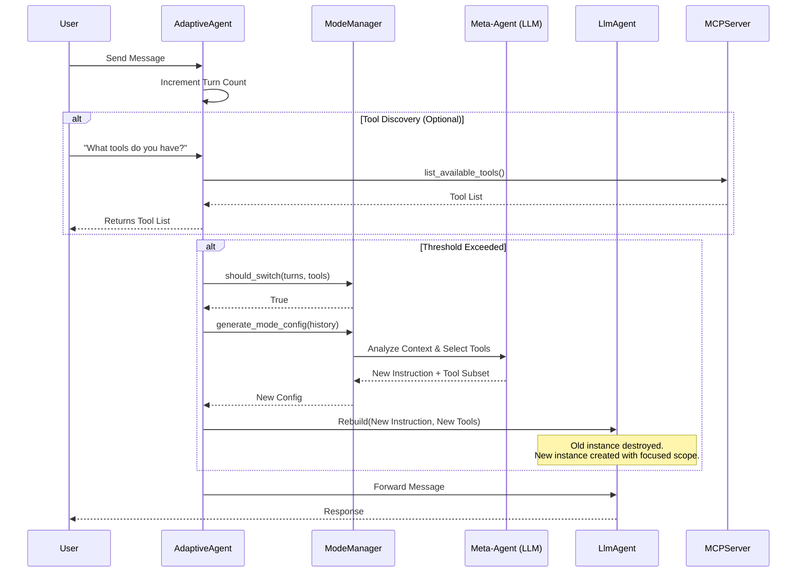
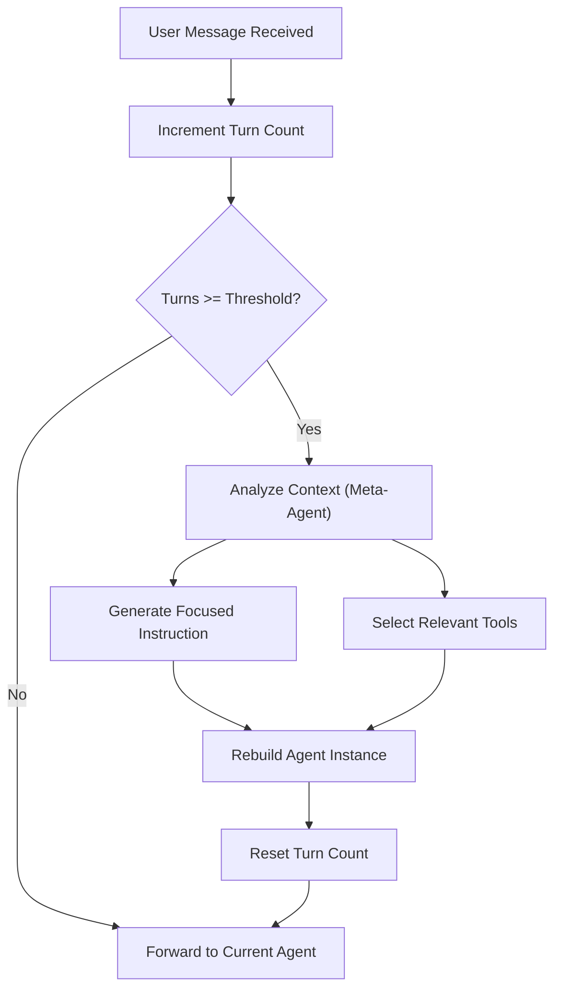

# Dynamic Agent Mode Switching (Adaptive Agent)

This document explains the architecture and behavior of the Dynamic Mode Switching mechanism implemented in the `dak_agent`.

## Overview

The `dak_agent` is equipped with an **Adaptive Layer** (`AdaptiveAgent`) that monitors the conversation context and dynamically adjusts the agent's configuration to maintain performance and focus.

### Why is this needed?
As a conversation grows, the context window fills up, and the number of available tools might become overwhelming or irrelevant to the current sub-task. This can lead to:
- **Degraded Performance**: The model struggles to attend to relevant instructions.
- **Hallucinations**: The model might try to use tools that are no longer relevant.
- **Cost/Latency**: Processing large contexts with many tool definitions is expensive.

## Mechanism

The mechanism consists of two main components:

1.  **AdaptiveAgent (`agent/dak_agent/adaptive_agent.py`)**:
    - Wraps the core `LlmAgent`.
    - Tracks the number of turns in the current "session" or "mode".
    - Triggers a switch when thresholds are met (e.g., `max_turns_before_switch`).

2.  **ModeManager (`agent/dak_agent/mode_manager.py`)**:
    - Decides *how* to switch.
    - Uses a "Meta-Agent" (LLM call) to analyze the conversation history.
    - Generates a **New System Instruction** and selects a **Subset of Tools** relevant to the *next* phase of the task.

### The Switching Process

### The Switching Process



### Decision Logic



1.  **Trigger**: The conversation context exceeds the token threshold (default 50% of model context window) OR the agent explicitly calls `switch_mode`.
2.  **Tool Discovery**: The agent has a built-in tool `list_available_tools` that dynamically queries the MCP server to find out what capabilities are available. This is often the first step before switching modes.
3.  **Meta-Analysis**: The `ModeManager` sends the conversation summary and list of *all* available tools to the LLM.
4.  **Reconfiguration**: The LLM returns:
    - A focused System Prompt (e.g., "You are now focused on debugging the database connection...").
    - A list of *only* the tools needed for this specific goal.
5.  **Rebuild**: The `AdaptiveAgent` destroys the old internal agent and creates a *new* `LlmAgent` instance with this new configuration.

## Tool Visibility & Context

### What happens to Tools?
When a switch occurs, the `tools` list passed to the underlying model is **physically replaced**.

- **Before Switch**: The model sees ALL tools (e.g., `[read_file, write_file, deep_think, planner, ...]`).
- **After Switch**: The model sees ONLY the selected tools (e.g., `[read_file, write_file]`) PLUS the always-available built-in tools (`switch_mode`, `list_available_tools`).

**Verification**: If you ask the agent "What tools do you have?" *after* a switch, it should only list the subset. If it lists tools it doesn't have, it is hallucinating based on its *internal* training knowledge or residual context (see below).

### What happens to Context (History)?
This is the critical part.

- **Current Implementation**: The `AdaptiveAgent` resets its *internal* turn count, but the `LlmAgent` (and the underlying ADK framework) typically maintains the **Conversation History** (User/Model messages).
- **The Challenge**: Even if we change the tools definition for the *next* turn, the *previous* messages in the history still contain the *old* system prompt and *old* tool definitions (implicitly or explicitly depending on how the provider handles history).

**If the agent still "knows" about old tools:**
1.  **Residual History**: The model sees previous turns where it used those tools.
2.  **Context Bias**: While the **System Instruction is completely replaced** (the API is stateless), the conversation history (User/Model messages) remains. The model might infer its role or capabilities from its own past behavior recorded in the history.
3.  **Hallucination**: The model might hallucinate tools based on the residual history, even though the System Instruction and Tool Definitions have been updated.

### How to Verify Correctness?

To truly verify that the tools are restricted:
1.  **Trigger a Switch**: Chat until the threshold is met.
2.  **Attempt to use a Forbidden Tool**: Ask the agent to perform an action that requires a tool *not* in the new set.
    - **Expected**: The agent should say "I cannot do that" or fail to call the tool.
    - **If it tries to call the tool**: The underlying framework (ADK/MCP) should reject the call because the tool is not registered in the current `LlmAgent` instance.

## Configuration

Thresholds are defined in `agent/dak_agent/mode_manager.py`:

```python
self.token_threshold = 0.5  # 50% threshold
```

## Future Improvements

- **Context Pruning**: Instead of just changing the prompt, we should summarize and *truncate* the history so the model genuinely forgets the old context.
- **Explicit Tool Denial**: The new System Prompt should explicitly state: "You ONLY have access to tools X and Y. Do not attempt to use others."
