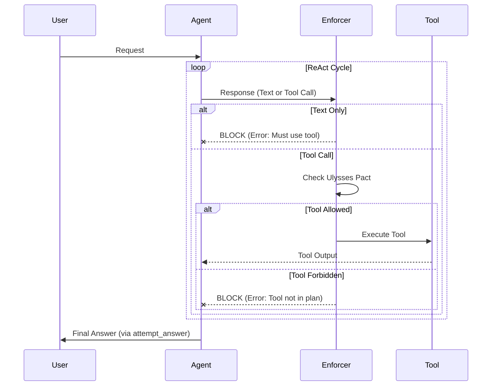
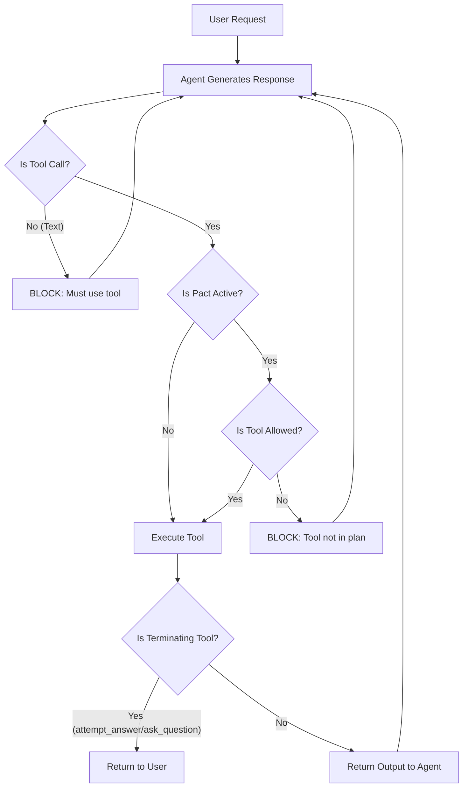

# Enforcer Mode (ReAct Pattern & Ulysses Pact)

Enforcer Mode is a strict operating mode for the `dak_agent` designed to maximize reliability and minimize hallucinations for complex tasks. It enforces a "ReAct" (Reasoning + Acting) loop and implements a "Ulysses Pact" mechanism for self-imposed constraints.

## Overview

In standard operation, LLMs can sometimes be unpredictable—skipping steps, hallucinating tools, or providing text answers when they should be performing actions. Enforcer Mode addresses this by:

1.  **Blocking Direct Text Responses**: The agent *must* use a tool for every turn. It cannot simply "talk" without acting, unless it is explicitly asking a clarifying question or providing the final answer.
2.  **Ulysses Pact**: The agent can voluntarily restrict its own tool access to a specific subset for a defined plan, preventing it from getting distracted by irrelevant tools.
3.  **Structured Workflow**: Enforces a `Plan -> Act -> Verify` loop.

### Sequence Diagram



## How it Works

### 1. The "No-Talk" Rule
When Enforcer Mode is enabled, the `enforcer_validator` intercepts every response from the LLM.
- **If the response contains a tool call**: It is allowed to proceed.
- **If the response is only text**: It is **BLOCKED**. The system returns an error to the LLM prompting it to use a tool.

**Exceptions**:
- `ask_question`: A specific tool to ask the user for input.
- `attempt_answer`: A specific tool to provide the final result to the user.

### 2. The Ulysses Pact (Self-Binding)
To handle complex tasks, the agent uses the `planner` tool to create a plan and bind itself to a specific set of tools.

**Example**:
The user asks: "Check the database status and then restart the service if needed."

1.  **Agent calls `planner`**:
    ```json
    {
      "task_description": "Check DB and restart service",
      "plan_steps": ["Check DB connection", "Restart service if down"],
      "allowed_tools": ["check_db_status", "restart_service"]
    }
    ```
2.  **System Enforces Pact**:
    - The `SessionState` is updated.
    - If the agent tries to call `delete_database` (not in `allowed_tools`), the system **BLOCKS** the action and returns a "Violation" error.
    - The agent must then stick to its plan or call `planner` again to update it.

### 3. ReAct Loop
This forces the agent into a loop:
- **Thought**: (Internal reasoning)
- **Action**: Call `planner` or a specific tool.
- **Observation**: Result from the tool.
- **Repeat**.

### Logic Flowchart



## Configuration

To enable Enforcer Mode, set the following environment variable in your `.env` file:

```bash
ENABLE_ENFORCER_MODE=true
```

## Available Tools in Enforcer Mode

In addition to the standard MCP tools, Enforcer Mode adds:

- **`planner(task_description, plan_steps, allowed_tools)`**:
    - Creates a plan and sets the allowed tools for the "Ulysses Pact".
    - Core tools (`planner`, `ask_question`, `attempt_answer`, `switch_mode`) are *always* allowed.

- **`ask_question(questions, context)`**:
    - Use this to speak to the user when you need information.

- **`attempt_answer(answer, confidence, sources_used)`**:
    - Use this to provide the final response to the user.

## When to Use

- **Complex Workflows**: Multi-step tasks where the agent might get lost.
- **Production Environments**: Where reliability and safety are paramount.
- **Debugging**: To force the agent to be explicit about its actions.
